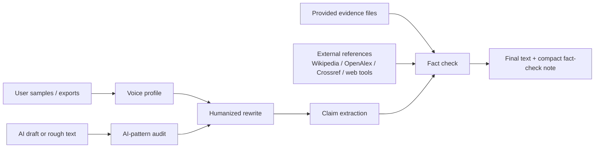

<p align="center">
  
</p>

<h1 align="center">humanize-skill</h1>

<p align="center">
  <strong>Make AI drafts sound like the user, then verify the claims before they ship.</strong>
</p>

<p align="center">
  <a href="./LICENSE"></a>
  
  
</p>

`humanize-skill` is a lightweight open-source skill for rewriting AI-looking text into a real human voice, preferably the user's own voice, while keeping factual claims grounded in evidence.

It is built from three reference ideas:

- [blader/humanizer](https://github.com/blader/humanizer): concrete AI-writing pattern cleanup.
- [tinyhumansai/openhuman](https://github.com/tinyhumansai/openhuman): local-first user context, source adapters, and provenance.
- [Oumi HallOumi](https://oumi.ai/blog/introducing-halloumi-a-state-of-the): claim extraction, evidence checks, citations, and support labels.

The result is deliberately small: no training pipeline, no background service, no mandatory OAuth broker, no model-specific lock-in.

## Why this exists

Most "humanize AI" tools only change the surface. They delete em dashes, add contractions, and call it done.

That is not enough.

Good humanized writing needs three things at once:

- **Voice**: it should sound like the person, not like generic "friendly SaaS copy".
- **Restraint**: it should remove AI tells without injecting fake personality.
- **Grounding**: it should not make unsupported facts sound more confident.

`humanize-skill` treats humanization as an editorial pipeline, not a vibe filter.

## Features

- **AI-pattern cleanup**: catches inflated significance, vague authority, promotional language, forced trios, chatbot residue, filler, and other common tells.
- **User voice profiling**: learns rhythm, diction, punctuation habits, paragraph shape, technical tone, and recurring vocabulary from local samples.
- **Local-first source ingestion**: works with pasted text, Markdown, JSON/JSONL, CSV/TSV, chat exports, social exports, and email/archive text.
- **External fact verification**: checks claims against provided evidence first, then searches public references when support is missing.
- **Conservative support labels**: returns `supported`, `needs_evidence`, `possibly_wrong`, or `style_only`.
- **Agent-native semantic rewrite**: Codex or Claude does the actual rewrite with context and judgment, not a regex script.
- **Skill-native workflow**: [SKILL.md](./SKILL.md) is the product, ready to install in Codex/Claude Code/OpenCode-style environments.

## Installation

### Codex

Clone directly into Codex's skills directory:

```bash
mkdir -p ~/.codex/skills
git clone https://github.com/fendouai/humanize-skill.git ~/.codex/skills/humanize-skill
```

Or copy the skill file manually if you already have this repo cloned:

```bash
mkdir -p ~/.codex/skills/humanize-skill
cp SKILL.md ~/.codex/skills/humanize-skill/
```

### Claude Code

Clone directly into Claude Code's skills directory:

```bash
mkdir -p ~/.claude/skills
git clone https://github.com/fendouai/humanize-skill.git ~/.claude/skills/humanize-skill
```

Or copy the skill file manually:

```bash
mkdir -p ~/.claude/skills/humanize-skill
cp SKILL.md ~/.claude/skills/humanize-skill/
```

### OpenCode

Clone directly into OpenCode's skills directory:

```bash
mkdir -p ~/.config/opencode/skills
git clone https://github.com/fendouai/humanize-skill.git ~/.config/opencode/skills/humanize-skill
```

OpenCode also scans `~/.claude/skills/` for compatibility, so one clone into `~/.claude/skills/humanize-skill/` can be enough if you use both tools.

## Usage

The simplest flow is the same as `humanizer`: invoke the skill and paste the text.

### Just Paste Text

```text
Use humanize-skill:

[paste the AI-looking text here]
```

Or ask directly:

```text
Please humanize this text:
[paste text]
```

This runs the default pass: remove AI-writing residue, preserve meaning, and flag factual claims that need evidence.

### Voice Calibration

To match your own voice, add one short writing sample:

```text
Use humanize-skill.

Here is my writing sample:
[paste 2-3 paragraphs of your own writing]

Now humanize this draft and fact-check the claims:
[paste draft]
```

The skill should not block a simple rewrite when no sample is provided. It should use the default voice first, then offer calibration when the user wants stronger personal matching.

### Stronger Real-Voice Sources

For a better voice profile, provide local notes, exported posts, chat/email archives, or a connector when your host agent supports one and you explicitly approve it.

Connector availability depends on the host:

| Source | Codex official skills | Claude official connectors | Notes for voice profiling |
| --- | --- | --- | --- |
| Gmail | Not in the OpenAI skills catalog | Supported | Strong source for sent-mail style when explicitly authorized |
| Slack | Workflow/integration capability, not a catalog skill | Supported | Strong source for casual/team voice and decision language |
| Google Drive | Not in the OpenAI skills catalog | Supported | Useful for docs, notes, essays, and long-form style |
| Google Calendar | Not in the OpenAI skills catalog | Supported | Useful context, not usually a primary writing-style source |
| Microsoft 365 | Not in the OpenAI skills catalog | Supported | Useful for Outlook/Docs style when available |
| GitHub | Supported through skills/plugins | Supported | Good for technical style, PR comments, issues, and README tone |
| X/Twitter, LinkedIn, Instagram, Facebook | No official first-party skill found | No first-party connector found | Use exports, browser-visible content, or custom/third-party MCP connectors |

For personal style cloning, Claude's first-party Gmail, Slack, and Drive connectors are usually the strongest official path. Codex is more flexible when you provide exports or build a custom MCP/skill bundle.

To make the fact-check pass stronger, provide evidence:

```text
Use humanize-skill on draft.md.
Use my samples in samples/ and verify claims against evidence/.
Save the final rewrite and a compact claim table.
```

## How it works



The fact-checker is intentionally conservative. It does not mark a claim as supported just because scattered search results contain overlapping keywords. A single reference must independently support enough of the claim.

## Patterns Detected

The pattern list is inspired by `blader/humanizer`'s README style, but extended for user voice and fact-checking. The goal is not to make text quirky. The goal is to remove generic AI residue, preserve the user's rhythm, and avoid unsupported confidence.

| Area | Pattern | AI-looking version | Humanized handling |
| --- | --- | --- | --- |
| Content | Significance inflation | "a pivotal moment in the broader landscape" | Say the actual change or remove the claim |
| Content | Promotional language | "groundbreaking, seamless, must-have" | Use concrete product behavior |
| Content | Vague authority | "experts say", "industry reports suggest" | Name the source or mark `needs_evidence` |
| Content | Superficial analysis | "showcasing", "underscoring", "reflecting" | Explain the mechanism or cut the flourish |
| Content | False ranges | "from X to Y" without a real scale | List the actual cases |
| Language | Copula avoidance | "serves as", "stands as", "boasts" | Prefer "is", "has", or a specific verb |
| Language | Negative parallelism | "not just X, but Y" | State the point directly |
| Language | Forced trios | "innovative, scalable, and seamless" | Keep only the real attributes |
| Language | Synonym cycling | "tool, platform, solution, system" | Repeat the clearest noun |
| Language | Filler | "in order to", "due to the fact that" | Use "to" and "because" |
| Style | Chatbot residue | "Great question", "hope this helps" | Remove it |
| Style | Decorative formatting | Excessive bold, emojis, Title Case | Use plain formatting unless the surface needs it |
| Style | Em dash habit | Long clauses joined with dashes | Use periods, commas, or parentheses |
| Style | Generic conclusions | "The future looks bright" | End with the specific implication |
| Voice | Generic friendliness | Polished but placeless SaaS tone | Match the user's sample rhythm and diction |
| Voice | Fake personality | Invented excitement or personal experience | Keep only what the user supplied |
| Voice | Over-cleaning | Every sentence becomes smooth and neutral | Preserve useful roughness or shorthand |
| Facts | Unsupported specificity | "cuts editing time in half" | Cite, soften, or remove |
| Facts | Current or risky claims | Product, legal, medical, financial, schedule claims | Verify with current primary sources |
| Facts | Perfect certainty | "verifies every fact" | Describe the actual review limit |

## Quick start

Clone this repository or copy [SKILL.md](./SKILL.md) into your agent's skills directory, then ask the agent to use `humanize-skill`.

There is no CLI. The rewrite is done by the host model, because humanizing text requires semantic judgment: fixing broken sentences, removing unsupported metrics, choosing what to soften, and matching the user's voice.

## Five Real Skill Runs

These examples were run through the skill in Codex. Each folder keeps the draft, writing sample, evidence, final rewrite, notes, and the Codex editorial run.

| Scenario | AI-looking draft | Humanized result | Fact decision | Saved process |
| --- | --- | --- | --- | --- |
| Product email | "Our groundbreaking workspace serves as a pivotal solution..." | "We shipped a workspace that turns a rough AI draft into three things..." | Removed the unsupported "cut editing time in half" claim. | [run](./examples/product-email/codex-run.md) · [notes](./examples/product-email/notes.md) · [final](./examples/product-email/final.md) |
| Technical README | "This revolutionary CLI offers a robust and seamless developer experience..." | "`humanize-skill` is an agent workflow for cleaning up AI-looking prose..." | Replaced "perfect accuracy" with conservative review-surface language. | [run](./examples/technical-readme/codex-run.md) · [notes](./examples/technical-readme/notes.md) · [final](./examples/technical-readme/final.md) |
| Social post | "I am thrilled to announce... a definitive solution..." | "Small ship: I made a skill for cleaning up AI-looking drafts." | Corrected automatic social-history analysis to user-provided samples or exports. | [run](./examples/social-post/codex-run.md) · [notes](./examples/social-post/notes.md) · [final](./examples/social-post/final.md) |
| Support reply | "Great question!... your data is always safe." | "One thing to clarify first: the skill does not sync your writing profile across channels." | Removed absolute safety and unsupported sync claims. | [run](./examples/support-reply/codex-run.md) · [notes](./examples/support-reply/notes.md) · [final](./examples/support-reply/final.md) |
| Research blog | "Studies show that humanized copy increases reader trust by 87%..." | "AI drafts often have two separate problems. They sound generic..." | Removed the fake 87% statistic and softened hallucination elimination. | [run](./examples/research-blog/codex-run.md) · [notes](./examples/research-blog/notes.md) · [final](./examples/research-blog/final.md) |

<details>
<summary>Product email</summary>

**Before**

```text
Great question! Our groundbreaking workspace serves as a pivotal solution for busy teams, showcasing how they can unlock seamless async collaboration across the modern AI landscape.
```

**After**

```text
We shipped a workspace that turns a rough AI draft into three things: a local voice profile, a cleaner rewrite, and a claim review you can hand to an editor.
```

**Process kept on disk**

- [draft](./examples/product-email/draft.md)
- [writing sample](./examples/product-email/sample.txt)
- [evidence](./examples/product-email/evidence.md)
- [Codex run](./examples/product-email/codex-run.md)
- [final rewrite](./examples/product-email/final.md)
- [notes](./examples/product-email/notes.md)

</details>

<details>
<summary>Technical README</summary>

**Before**

```text
This revolutionary CLI offers a robust and seamless developer experience, enabling users to effortlessly transform AI-generated prose into authentic human communication.
```

**After**

```text
`humanize-skill` is an agent workflow for cleaning up AI-looking prose, building a compact voice profile from user-provided samples, and checking claim-like sentences against evidence.
```

**Process kept on disk**

- [draft](./examples/technical-readme/draft.md)
- [writing sample](./examples/technical-readme/sample.txt)
- [evidence](./examples/technical-readme/evidence.md)
- [Codex run](./examples/technical-readme/codex-run.md)
- [final rewrite](./examples/technical-readme/final.md)
- [notes](./examples/technical-readme/notes.md)

</details>

<details>
<summary>Social post</summary>

**Before**

```text
I am thrilled to announce that I have launched a groundbreaking open-source skill that empowers creators to reclaim their authentic voice in the AI era.
```

**After**

```text
Small ship: I made a skill for cleaning up AI-looking drafts.
```

**Process kept on disk**

- [draft](./examples/social-post/draft.md)
- [writing sample](./examples/social-post/sample.txt)
- [evidence](./examples/social-post/evidence.md)
- [Codex run](./examples/social-post/codex-run.md)
- [final rewrite](./examples/social-post/final.md)
- [notes](./examples/social-post/notes.md)

</details>

<details>
<summary>Support reply</summary>

**Before**

```text
Great question! We sincerely apologize for any inconvenience this may have caused. Our system is designed to seamlessly synchronize your writing profile across every channel, and your data is always safe.
```

**After**

```text
One thing to clarify first: the skill does not sync your writing profile across channels. It uses the text, files, exports, or authorized connectors you choose for that run.
```

**Process kept on disk**

- [draft](./examples/support-reply/draft.md)
- [writing sample](./examples/support-reply/sample.txt)
- [evidence](./examples/support-reply/evidence.md)
- [Codex run](./examples/support-reply/codex-run.md)
- [final rewrite](./examples/support-reply/final.md)
- [notes](./examples/support-reply/notes.md)

</details>

<details>
<summary>Research blog</summary>

**Before**

```text
Studies show that humanized copy increases reader trust by 87%, and tools that verify claims eliminate hallucinations.
```

**After**

```text
That does not eliminate hallucinations. It gives the writer a clearer review step before the text goes out.
```

**Process kept on disk**

- [draft](./examples/research-blog/draft.md)
- [writing sample](./examples/research-blog/sample.txt)
- [evidence](./examples/research-blog/evidence.md)
- [Codex run](./examples/research-blog/codex-run.md)
- [final rewrite](./examples/research-blog/final.md)
- [notes](./examples/research-blog/notes.md)

</details>

## External verification

The skill does not rely on the LLM's memory as a source of truth.

Verification order:

1. Check user-provided evidence and local files.
2. For missing, current, or high-risk claims, search external references.
3. Prefer official, primary, or scholarly sources when available.
4. Keep source title, URL, snippet, and matched terms.
5. If support is still weak, mark `needs_evidence` and soften or remove the claim.

Host agents should use their own current web/search tools under the rules in [SKILL.md](./SKILL.md). Public APIs can rate-limit or return weak snippets, so the agent should cite strong sources when available and mark weak support as `needs_evidence`.

## Project structure

```text
.
├── SKILL.md                    # Agent-facing skill workflow
├── examples/                   # Five Codex skill runs with saved agent artifacts
├── docs/
│   ├── reference-analysis.md   # What was borrowed from the three references
│   └── source-ingestion.md     # Local-first real-user text ingestion policy
├── assets/
│   └── humanize-skill-hero.png # README hero image generated with gpt-image-2
└── LICENSE
```

## Design principles

- **Small beats heavy**: this is a skill, not a full desktop agent or standalone rewriting app.
- **User data stays controlled**: build compact profiles, not raw private-message stores.
- **Voice is not decoration**: match rhythm and choices, not just slang.
- **Verification is separate**: rewrite first, fact-check second, then revise.
- **Unsupported specifics are a bug**: remove, soften, cite, or ask.

## Validation

Validate the skill by running realistic prompts through Codex or Claude and saving the run in `examples/<scenario>/codex-run.md` or an equivalent agent-run note. The pass/fail question is whether the agent preserves meaning, matches the requested voice, removes AI residue semantically, and handles unsupported claims conservatively.

## Roadmap

- Add optional domain presets for product copy, README prose, essays, and social posts.
- Add examples showing voice profiles from bilingual samples.
- Add more examples that use Claude Gmail, Slack, or Drive connectors as real voice sources.

## References

- [OpenAI skills catalog](https://github.com/openai/skills): official Codex skills catalog and installable skill structure.
- [Claude Connectors overview](https://claude.com/docs/connectors/overview): first-party connectors, MCP-based connectors, plugins, and Claude Code connector availability.
- [Claude Gmail connector](https://claude.com/connectors/gmail): Gmail search, summarization, information surfacing, and draft-reply workflow.
- [Claude Slack integration](https://claude.com/docs/connectors/slack): Slack search and workspace context access.
- [blader/humanizer](https://github.com/blader/humanizer): installation and usage clarity, AI-writing pattern catalog, and full before/after examples.
- [Wikipedia: Signs of AI writing](https://en.wikipedia.org/wiki/Wikipedia:Signs_of_AI_writing): pattern source used by `blader/humanizer` and WikiProject AI Cleanup.
- [tinyhumansai/openhuman](https://github.com/tinyhumansai/openhuman): local-first user context, source adapters, and provenance ideas.
- [Oumi HallOumi](https://oumi.ai/blog/introducing-halloumi-a-state-of-the): claim extraction, evidence checks, citations, and support labels.

## Version History

- 0.3.0 - Removed the misleading CLI layer. The skill is now agent-native: Codex or Claude performs the semantic rewrite, with examples documenting real agent runs.
- 0.2.0 - Added Codex-run examples with saved intermediate artifacts, a new README hero focused on user inputs and fact verification, and README sections modeled after `blader/humanizer`'s install/use/pattern clarity.
- 0.1.0 - Initial skill workflow with AI-pattern cleanup, voice profiling, local source ingestion, and lightweight fact-checking.

## License

MIT. See [LICENSE](./LICENSE).
