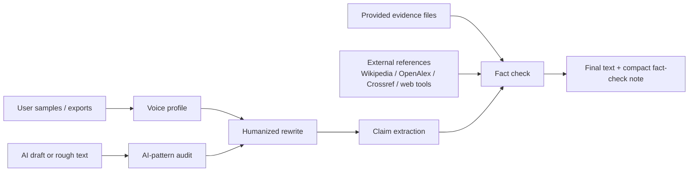

<p align="center">
  
</p>

<h1 align="center">humanize-skill</h1>

<p align="center">
  <strong>Make AI drafts sound like the user, then verify the claims before they ship.</strong>
</p>

<p align="center">
  <a href="./LICENSE"></a>
  
  
  
</p>

`humanize-skill` is a lightweight open-source skill for rewriting AI-looking text into a real human voice, preferably the user's own voice, while keeping factual claims grounded in evidence.

It is built from three reference ideas:

- [blader/humanizer](https://github.com/blader/humanizer): concrete AI-writing pattern cleanup.
- [tinyhumansai/openhuman](https://github.com/tinyhumansai/openhuman): local-first user context, source adapters, and provenance.
- [Oumi HallOumi](https://oumi.ai/blog/introducing-halloumi-a-state-of-the): claim extraction, evidence checks, citations, and support labels.

The result is deliberately small: no training pipeline, no background service, no mandatory OAuth broker, no model-specific lock-in.

## Why this exists

Most "humanize AI" tools only change the surface. They delete em dashes, add contractions, and call it done.

That is not enough.

Good humanized writing needs three things at once:

- **Voice**: it should sound like the person, not like generic "friendly SaaS copy".
- **Restraint**: it should remove AI tells without injecting fake personality.
- **Grounding**: it should not make unsupported facts sound more confident.

`humanize-skill` treats humanization as an editorial pipeline, not a vibe filter.

## Features

- **AI-pattern cleanup**: catches inflated significance, vague authority, promotional language, forced trios, chatbot residue, filler, and other common tells.
- **User voice profiling**: learns rhythm, diction, punctuation habits, paragraph shape, technical tone, and recurring vocabulary from local samples.
- **Local-first source ingestion**: works with pasted text, Markdown, JSON/JSONL, CSV/TSV, chat exports, social exports, and email/archive text.
- **External fact verification**: checks claims against provided evidence first, then searches public references when support is missing.
- **Conservative support labels**: returns `supported`, `needs_evidence`, `possibly_wrong`, or `style_only`.
- **Zero dependency CLI**: standard-library Python helper for repeatable audits and tests.
- **Skill-native workflow**: the main product is [SKILL.md](./SKILL.md), ready to install in Codex/Claude Code/OpenCode-style environments.

## How it works



The fact-checker is intentionally conservative. It does not mark a claim as supported just because scattered search results contain overlapping keywords. A single reference must independently support enough of the claim.

## Quick start

Clone this repository or copy [SKILL.md](./SKILL.md) into your agent's skills directory.

Run the helper locally:

```bash
python3 scripts/humanize_skill.py audit draft.md
python3 scripts/humanize_skill.py profile samples/*.txt --out .humanize-skill/profile.json
python3 scripts/humanize_skill.py humanize draft.md --profile .humanize-skill/profile.json
python3 scripts/humanize_skill.py factcheck draft.md --evidence sources/*.md
python3 scripts/humanize_skill.py factcheck draft.md --external
```

Install as a Python console script:

```bash
pip install -e .
humanize-skill audit draft.md
```

## Example

Input:

```text
Great question! Our groundbreaking platform serves as a pivotal solution,
showcasing how teams can unlock seamless collaboration across the modern
AI landscape. It is not just a writing tool, but a trust layer.
```

Humanized:

```text
The tool rewrites AI-looking drafts and checks the factual claims before you publish them.
It is meant for people who want cleaner writing without quietly adding unsupported details.
```

Fact-check note:

```json
[
  {
    "claim": "The tool rewrites AI-looking drafts and checks the factual claims before you publish them.",
    "status": "supported",
    "source_type": "provided_evidence"
  }
]
```

## External verification

The skill does not rely on the LLM's memory as a source of truth.

Verification order:

1. Check user-provided evidence and local files.
2. For missing, current, or high-risk claims, search external references.
3. Prefer official, primary, or scholarly sources when available.
4. Keep source title, URL, snippet, and matched terms.
5. If support is still weak, mark `needs_evidence` and soften or remove the claim.

The CLI currently includes lightweight search adapters for:

- Wikipedia
- OpenAlex
- Crossref
- DuckDuckGo HTML results when available

Host agents can also use their own web/search tools under the rules in [SKILL.md](./SKILL.md).

## Project structure

```text
.
├── SKILL.md                    # Agent-facing skill workflow
├── scripts/
│   └── humanize_skill.py       # Zero-dependency CLI helper
├── tests/
│   └── test_humanize_skill.py  # Unit tests for audit/profile/factcheck behavior
├── docs/
│   ├── reference-analysis.md   # What was borrowed from the three references
│   └── source-ingestion.md     # Local-first real-user text ingestion policy
├── assets/
│   └── humanize-skill-hero.png # README hero image generated with gpt-image-2
├── humanizer/                  # Saved reference clone: blader/humanizer
├── openhuman/                  # Saved reference clone: tinyhumansai/openhuman
└── oumi/                       # Saved reference clone: oumi-ai/oumi
```

## Design principles

- **Small beats heavy**: this is a skill and helper, not a full desktop agent.
- **User data stays controlled**: build compact profiles, not raw private-message stores.
- **Voice is not decoration**: match rhythm and choices, not just slang.
- **Verification is separate**: rewrite first, fact-check second, then revise.
- **Unsupported specifics are a bug**: remove, soften, cite, or ask.

## Development

```bash
python3 -m unittest discover -s tests
python3 -m py_compile scripts/humanize_skill.py tests/test_humanize_skill.py
```

The helper uses only the Python standard library.

## Roadmap

- Add source-quality scoring for external references.
- Add optional domain presets for product copy, README prose, essays, and social posts.
- Add JSON report output for CI or editorial workflows.
- Add more archive readers for common chat/social export formats.
- Add examples showing voice profiles from bilingual samples.

## License

MIT. See [LICENSE](./LICENSE).
