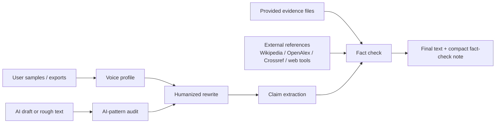

<p align="center">
  
</p>

<h1 align="center">humanize-skill</h1>

<p align="center">
  <strong>Make AI drafts sound like the user, then verify the claims before they ship.</strong>
</p>

<p align="center">
  <a href="./LICENSE"></a>
  
  
</p>

`humanize-skill` is a lightweight open-source skill for improving AI-looking or rough drafts: less hype, more real voice, and factual claims grounded in evidence.

It is not designed to bypass AI detectors, and it does not guarantee detector outcomes.

It is built from three reference ideas:

- [blader/humanizer](https://github.com/blader/humanizer): concrete AI-writing pattern cleanup.
- [tinyhumansai/openhuman](https://github.com/tinyhumansai/openhuman): local-first user context, source adapters, and provenance.
- [Oumi HallOumi](https://oumi.ai/blog/introducing-halloumi-a-state-of-the): claim extraction, evidence checks, citations, and support labels.

The result is deliberately small: no training pipeline, no background service, no mandatory OAuth broker, no model-specific lock-in.

## Why this exists

Most "humanize AI" tools only change the surface. They delete em dashes, add contractions, and call it done.

That is not enough.

Good humanized writing is a quality problem, not a detector-evasion problem. It needs three things at once:

- **Voice**: it should sound like the person, not like generic "friendly SaaS copy".
- **Restraint**: it should remove AI tells without injecting fake personality.
- **Grounding**: it should not make unsupported facts sound more confident.

Underneath all three sits one deeper signal: **specificity**. Concrete numbers, named people, dated events, and visible reasoning are what actually separate a useful rewrite from a generic one. The skill runs an explicit pass on this signal — see [docs/specificity-and-thought.md](./docs/specificity-and-thought.md). It is not a detector-evasion trick. It is what good writing always did.

`humanize-skill` treats humanization as an editorial pipeline, not a vibe filter.

## Core Features

### 1. Quality-first humanization

The skill improves the draft instead of chasing detector outcomes. It removes hype, filler, vague authority, chatbot residue, and unsupported confidence so the text becomes clearer, more specific, and more credible.

### 2. Deep voice matching

When the user supplies real samples, the skill matches both surface and deep voice signals: rhythm, paragraph shape, diction, punctuation, stance, conclusion ordering, repair, perspective, hedging style, domain vocabulary, and signature tells.

### 3. Five-layer AI-pattern diagnosis

The skill diagnoses AI-looking prose across five layers:

- lexical: inflated words, promotional vocabulary, vague attribution
- phrasal: memorized templates, negative parallelism, generic openers and closers
- syntactic: over-balanced clauses, uniform sentence length, em dash dependency
- structural: heading cadence, bullet-list overuse, intro-body-summary shape
- cognitive: uniform confidence, hidden reasoning, no stated limits, generic examples, no real stance

The catalog is diagnostic. The final rewrite is semantic editing, not substring deletion.

### 4. Specificity and reasoning pass

The deepest pass turns empty generalities into concrete writing. It looks for numbers, dates, names, places, context, limits, and visible reasoning: the "but", the "because", the "I don't know", the comparison, and the constraint that actually explains the claim.

### 5. Fact-aware rewriting

The skill treats factual claims as editing obligations. Claims are supported, weakened, marked, or removed. This is especially important for product copy, research summaries, health writing, technical docs, legal or financial text, and anything public-facing.

## Boundary

This skill improves writing quality and factual grounding. It is not designed to bypass AI detectors, and it does not guarantee detector outcomes.

Use it to:

- remove chatbot residue, hype, filler, vague authority, and unsupported claims
- match the user's real voice when samples or authorized sources are available
- make drafts clearer, more specific, and easier to review
- fact-check risky or specific claims before publishing

Do not use it to:

- promise a pass on GPTZero, Originality.ai, Turnitin, or similar tools
- add fake typos, awkwardness, slang, or random rhythm just to manipulate a detector
- replace honest authorship disclosure policies where they apply

## Alternative methodology (user opt-in)

The main workflow in this skill is built around writing quality. A separate, optional appendix documents a different methodology whose purpose is to lower AI-detector classification scores. See [docs/detection-aware-methods.md](./docs/detection-aware-methods.md) for the full description, including the translation-chain, multi-turn LLM rewriting, detection-guided feedback, and mixed-engine approaches, plus the Standard Pipeline that combines them.

The two methodologies are not interchangeable. The main workflow is the recommended path. The alternative methodology is documented for reference, for users who have made an informed choice, and for projects whose requirements differ from this skill's main stance.

**The skill does not recommend, default to, or actively promote the alternative methodology.** The non-goals and the boundary in the section above still apply. If you use the alternative methodology, you take responsibility for the trade-offs — voice loss, style loss, meaning drift, no fact guarantee, and detector drift over time. Do not invoke the alternative methodology unless the user has explicitly asked for it.

## Feature Details

- **AI-pattern cleanup across five layers**: catches lexical, phrasal, syntactic, structural, and *cognitive* tells. The cognitive layer is the one that detector-style tools are most sensitive to. See [docs/anti-ai-patterns.md](./docs/anti-ai-patterns.md).
- **Deep voice profiling**: matches surface rhythm and the deeper fingerprint — stance, conclusion ordering, repair, perspective, hedge pattern, signature tells. Surface features make prose sound like the rhythm. Deep features make it sound like the *person*. See [docs/voice-profile-deep.md](./docs/voice-profile-deep.md).
- **Specificity and thought visibility pass**: replaces generic claims with concrete ones (numbers, time, names, place, sensory detail) and surfaces the writer's reasoning on the page (the "but", the "because", the "I don't know", the comparison, the limit). This is the deepest signal that separates generic AI text from a useful rewrite. See [docs/specificity-and-thought.md](./docs/specificity-and-thought.md).
- **User voice profiling**: learns rhythm, diction, punctuation habits, paragraph shape, technical tone, and recurring vocabulary from local samples.
- **Local-first source ingestion**: works with pasted text, Markdown, JSON/JSONL, CSV/TSV, chat exports, social exports, and email/archive text.
- **External fact verification**: checks claims against provided evidence first, then searches public references when support is missing.
- **Conservative support labels**: returns `supported`, `needs_evidence`, `possibly_wrong`, or `style_only`.
- **Agent-native semantic rewrite**: Codex or Claude does the actual rewrite with context and judgment, not a regex script.
- **Skill-native workflow**: [SKILL.md](./SKILL.md) is the product, ready to install in Codex/Claude Code/OpenCode-style environments.
- **Detector-boundary clarity**: improves prose and grounding without claiming or optimizing for AI-detector evasion.

### AI-pattern catalog

The skill's anti-AI work is anchored in [Wikipedia: Signs of AI writing](https://en.wikipedia.org/wiki/Wikipedia:Signs_of_AI_writing), the community-maintained catalog that WikiProject AI Cleanup uses to identify LLM-generated text on a high-stakes surface. The catalog below lists the specific patterns the skill diagnoses and rewrites, with Wikipedia anchor links to the canonical labels. The full five-layer catalog — lexical, phrasal, syntactic, structural, and cognitive — with examples, reasons, and fixes per pattern lives in [docs/anti-ai-patterns.md](./docs/anti-ai-patterns.md).

**Lexical tells** — words and short phrases that read as AI through density and clustering:

- [Significance inflation](https://en.wikipedia.org/wiki/Wikipedia:Signs_of_AI_writing#Significance_inflation) — "pivotal", "testament", "landmark", "watershed", "paradigm shift".
- [Promotional vocabulary](https://en.wikipedia.org/wiki/Wikipedia:Signs_of_AI_writing#Promotional_vocabulary) — "groundbreaking", "revolutionary", "cutting-edge", "seamless", "robust".
- [Vague attribution](https://en.wikipedia.org/wiki/Wikipedia:Signs_of_AI_writing#Vague_attribution) — "experts say", "studies show", "widely recognized".
- [Approval and enthusiasm words](https://en.wikipedia.org/wiki/Wikipedia:Signs_of_AI_writing#Communication_tells) — "thrilled", "excited to announce", "proud to share".
- [Lexical smoothing](https://en.wikipedia.org/wiki/Wikipedia:Signs_of_AI_writing#Inflated_symbolism) — synonym cycling, "tool / platform / solution / ecosystem" in one piece.
- [Generic intensifiers](https://en.wikipedia.org/wiki/Wikipedia:Signs_of_AI_writing#Generic_intensifiers) — "very", "really", "incredibly" stacked on vague nouns.
- [Corporate and consulting-deck phrases](https://en.wikipedia.org/wiki/Wikipedia:Signs_of_AI_writing#Sycophantic_/_corporate_language) — "delve into", "navigate the landscape", "unlock potential".

**Phrasal and structural patterns** — full clauses and templates that read as memorized openings or closers:

- [Negative parallelism](https://en.wikipedia.org/wiki/Wikipedia:Signs_of_AI_writing#Phrasal_patterns) — "not just X, but Y", "more than just X — it is Y".
- [Rule of three](https://en.wikipedia.org/wiki/Wikipedia:Signs_of_AI_writing#Rule_of_three) — three-clause parallelism, three-item lists.
- [Universal-audience framing](https://en.wikipedia.org/wiki/Wikipedia:Signs_of_AI_writing#Phrasal_patterns) — "Whether you are X or Y", "for teams of 5 or 50,000".
- [Throat-clearing openers](https://en.wikipedia.org/wiki/Wikipedia:Signs_of_AI_writing#Phrasal_patterns) — "In today's rapidly evolving landscape", "In an era defined by".
- [Copula avoidance](https://en.wikipedia.org/wiki/Wikipedia:Signs_of_AI_writing#Phrasal_patterns) — "serves as", "stands as", "boasts" where "is" or "has" would do.
- [Superficial participles](https://en.wikipedia.org/wiki/Wikipedia:Signs_of_AI_writing#Phrasal_patterns) — "showcasing", "highlighting", "underscoring" used as decoration.
- [Generic conclusions](https://en.wikipedia.org/wiki/Wikipedia:Signs_of_AI_writing#Phrasal_patterns) — "In conclusion", "The future looks bright", "Exciting times lie ahead".

**Syntactic tells** — how AI builds sentences:

- [Em dash overuse](https://en.wikipedia.org/wiki/Wikipedia:Signs_of_AI_writing#Syntactic_tells) — hard default to remove, with a voice-profile exception when the user writes that way.
- [Balanced parallelism](https://en.wikipedia.org/wiki/Wikipedia:Signs_of_AI_writing#Syntactic_tells) — clauses of identical length and structure stacked for emphasis.
- [Uniform sentence length](https://en.wikipedia.org/wiki/Wikipedia:Signs_of_AI_writing#Syntactic_tells) — most sentences 15–25 words, little variation.
- [Nominalization](https://en.wikipedia.org/wiki/Wikipedia:Signs_of_AI_writing#Syntactic_tells) — verb-to-noun drift ("perform an analysis of" instead of "analyze").

**Chatbot residue** — the conversational layer of chat assistants leaking into prose:

- [Chatbot tells](https://en.wikipedia.org/wiki/Wikipedia:Signs_of_AI_writing#Communication_tells) — "Great question!", "I hope this helps", "Feel free to", "Let me know if you have any other questions".
- [Filler transitions](https://en.wikipedia.org/wiki/Wikipedia:Signs_of_AI_writing#Communication_tells) — "In order to", "Due to the fact that", "It is worth noting that".

**Structural and cognitive layers** — added by humanize-skill because detector-style tools are most sensitive to them. Listed here for completeness, not as Wikipedia content.

- Structural: heading cadence, bullet-list as default, intro-body-summary sandwich, decorative formatting, TL;DR-before-content.
- Cognitive: uniform confidence, no stated limits, missing first person, hidden reasoning, generic examples, conflict avoidance, hedging without commitment.

The catalog is a *diagnostic aid*. The rewrite is editorial judgment applied to the specific draft, surface, and voice profile. Pattern removal does not guarantee any specific detector outcome.

## Installation

### Codex

Clone directly into Codex's skills directory:

```bash
mkdir -p ~/.codex/skills
git clone https://github.com/fendouai/humanize-skill.git ~/.codex/skills/humanize-skill
```

Or copy the skill file manually if you already have this repo cloned:

```bash
mkdir -p ~/.codex/skills/humanize-skill
cp SKILL.md ~/.codex/skills/humanize-skill/
```

### Claude Code

Clone directly into Claude Code's skills directory:

```bash
mkdir -p ~/.claude/skills
git clone https://github.com/fendouai/humanize-skill.git ~/.claude/skills/humanize-skill
```

Or copy the skill file manually:

```bash
mkdir -p ~/.claude/skills/humanize-skill
cp SKILL.md ~/.claude/skills/humanize-skill/
```

### OpenCode

Clone directly into OpenCode's skills directory:

```bash
mkdir -p ~/.config/opencode/skills
git clone https://github.com/fendouai/humanize-skill.git ~/.config/opencode/skills/humanize-skill
```

OpenCode also scans `~/.claude/skills/` for compatibility, so one clone into `~/.claude/skills/humanize-skill/` can be enough if you use both tools.

## Usage

The simplest flow is the same as `humanizer`: invoke the skill and paste the text.

### Just Paste Text

```text
Use humanize-skill:

[paste the AI-looking text here]
```

Or ask directly:

```text
Please humanize this text:
[paste text]
```

This runs the default pass: remove AI-writing residue, preserve meaning, and flag factual claims that need evidence.

If your real goal is stronger personal voice, provide samples or authorized writing sources. Without real voice data, the skill can improve clarity and reduce hype, but it should not pretend to clone your style.

### Voice Calibration

To match your own voice, add one short writing sample:

```text
Use humanize-skill.

Here is my writing sample:
[paste 2-3 paragraphs of your own writing]

Now humanize this draft and fact-check the claims:
[paste draft]
```

The skill should not block a simple rewrite when no sample is provided. It should use the default voice first, then offer calibration when the user wants stronger personal matching.

### Stronger Real-Voice Sources

For a better voice profile, provide local notes, exported posts, chat/email archives, or a connector when your host agent supports one and you explicitly approve it.

Connector availability depends on the host:

| Source | Codex official skills | Claude official connectors | Notes for voice profiling |
| --- | --- | --- | --- |
| Gmail | Not in the OpenAI skills catalog | Supported | Strong source for sent-mail style when explicitly authorized |
| Slack | Workflow/integration capability, not a catalog skill | Supported | Strong source for casual/team voice and decision language |
| Google Drive | Not in the OpenAI skills catalog | Supported | Useful for docs, notes, essays, and long-form style |
| Google Calendar | Not in the OpenAI skills catalog | Supported | Useful context, not usually a primary writing-style source |
| Microsoft 365 | Not in the OpenAI skills catalog | Supported | Useful for Outlook/Docs style when available |
| GitHub | Supported through skills/plugins | Supported | Good for technical style, PR comments, issues, and README tone |
| X/Twitter, LinkedIn, Instagram, Facebook | No official first-party skill found | No first-party connector found | Use exports, browser-visible content, or custom/third-party MCP connectors |

For personal style cloning, Claude's first-party Gmail, Slack, and Drive connectors are usually the strongest official path. Codex is more flexible when you provide exports or build a custom MCP/skill bundle.

To make the fact-check pass stronger, provide evidence:

```text
Use humanize-skill on draft.md.
Use my samples in samples/ and verify claims against evidence/.
Save the final rewrite and a compact claim table.
```

## How it works



The fact-checker is intentionally conservative. It does not mark a claim as supported just because scattered search results contain overlapping keywords. A single reference must independently support enough of the claim.

## Patterns Detected

The pattern list is inspired by `blader/humanizer`'s README style, but extended for user voice and fact-checking. The goal is not to make text quirky or bypass detectors. The goal is to remove generic AI residue, preserve the user's rhythm, and avoid unsupported confidence.

| Area | Pattern | AI-looking version | Humanized handling |
| --- | --- | --- | --- |
| Content | Significance inflation | "a pivotal moment in the broader landscape" | Say the actual change or remove the claim |
| Content | Promotional language | "groundbreaking, seamless, must-have" | Use concrete product behavior |
| Content | Vague authority | "experts say", "industry reports suggest" | Name the source or mark `needs_evidence` |
| Content | Superficial analysis | "showcasing", "underscoring", "reflecting" | Explain the mechanism or cut the flourish |
| Content | False ranges | "from X to Y" without a real scale | List the actual cases |
| Language | Copula avoidance | "serves as", "stands as", "boasts" | Prefer "is", "has", or a specific verb |
| Language | Negative parallelism | "not just X, but Y" | State the point directly |
| Language | Forced trios | "innovative, scalable, and seamless" | Keep only the real attributes |
| Language | Synonym cycling | "tool, platform, solution, system" | Repeat the clearest noun |
| Language | Filler | "in order to", "due to the fact that" | Use "to" and "because" |
| Style | Chatbot residue | "Great question", "hope this helps" | Remove it |
| Style | Decorative formatting | Excessive bold, emojis, Title Case | Use plain formatting unless the surface needs it |
| Style | Em dash habit | Long clauses joined with dashes | Use periods, commas, or parentheses |
| Style | Generic conclusions | "The future looks bright" | End with the specific implication |
| Voice | Generic friendliness | Polished but placeless SaaS tone | Match the user's sample rhythm and diction |
| Voice | Fake personality | Invented excitement or personal experience | Keep only what the user supplied |
| Voice | Over-cleaning | Every sentence becomes smooth and neutral | Preserve useful roughness or shorthand |
| Thinking | Uniform confidence | Every claim stated the same way | Vary confidence to match the evidence |
| Thinking | No stated limits | "Works for any team" | State the actual limit or scope |
| Thinking | Missing reasoning | Conclusions without "because" or "but" | Make the reasoning load-bearing on the page |
| Thinking | Generic examples | "Imagine a small startup" | Use real or specifically dimensioned examples |
| Thinking | Conflict avoidance | "Some say X, others say Y" without a position | State the writer's stance or mark the question open |
| Specificity | Vague numbers | "many users", "significant improvement" | Cite the count, the delta, the date |
| Specificity | Anonymized actors | "a user reported" | Use names the user has the right to share |
| Specificity | Floating time | "recently", "in the modern era" | Anchor in a real date or event |
| Facts | Unsupported specificity | "cuts editing time in half" | Cite, soften, or remove |
| Facts | Current or risky claims | Product, legal, medical, financial, schedule claims | Verify with current primary sources |
| Facts | Perfect certainty | "verifies every fact" | Describe the actual review limit |
| Facts | Invented statistic | "studies show 87%", "300% productivity gain" | Remove, or replace with the user's own data |
| Facts | Fuzzy attribution | "experts say", "industry reports suggest" | Name a real source or cut the attribution |
| Facts | Anachronism | A 2018 statistic used as 2025 currency | Re-date or remove |
| Facts | Confabulated authority | "according to a Stanford study..." that does not exist | Verify the actual study; remove if not found |
| Facts | Hallucinated quote | A famous-sounding line not in the speaker's corpus | Verify with the speaker's own writings |
| Facts | Wrongly attributed identity | Two people with similar names; a position held by the wrong person | Verify with a primary biographical source |
| Facts | Implied causation | "X improved because of Y" with no on-page mechanism | Soften to "after" or "when" |

The table above is a quick index. The full five-layer catalog with examples, reasons, and fixes per pattern lives in [docs/anti-ai-patterns.md](./docs/anti-ai-patterns.md). The deepest layer (cognitive) and the specificity pass are the ones detector-style tools are most sensitive to. The depth method for the fact-check pass — claim taxonomy, source hierarchy, conflict protocol, fix matrix — lives in [docs/fact-check.md](./docs/fact-check.md).

## Quick start

Clone this repository or copy [SKILL.md](./SKILL.md) into your agent's skills directory, then ask the agent to use `humanize-skill`.

There is no CLI. The rewrite is done by the host model, because humanizing text requires semantic judgment: fixing broken sentences, removing unsupported metrics, choosing what to soften, and matching the user's voice.

## Eight Real Skill Runs

These examples were rerun through the skill in Codex as agent-native E2E tests. Each folder keeps the draft, writing sample, evidence, final rewrite, notes, and the Codex run.

| Scenario | AI-looking draft | Humanized result | Fact decision | Saved process |
| --- | --- | --- | --- | --- |
| Product email | "Our groundbreaking workspace serves as a pivotal solution..." | "We shipped a workspace for teams that edit AI drafts together." | Removed the unsupported "cut editing time in half" claim. | [run](./examples/product-email/codex-run.md) · [notes](./examples/product-email/notes.md) · [final](./examples/product-email/final.md) |
| Technical README | "This revolutionary CLI offers a robust and seamless developer experience..." | "`humanize-skill` is an agent workflow for rewriting AI-looking drafts." | Removed CLI/package claims and replaced "perfect accuracy" with conservative review-step language. | [run](./examples/technical-readme/codex-run.md) · [notes](./examples/technical-readme/notes.md) · [final](./examples/technical-readme/final.md) |
| Social post | "I am thrilled to announce... a definitive solution..." | "Small ship: I made a skill for cleaning up AI-looking drafts." | Corrected automatic social-history analysis to user-chosen samples or exports. | [run](./examples/social-post/codex-run.md) · [notes](./examples/social-post/notes.md) · [final](./examples/social-post/final.md) |
| Support reply | "Great question!... your data is always safe." | "I am going to separate what I know from what I still need to check." | Removed absolute safety, automatic sync, and unsupported reconnect claims. | [run](./examples/support-reply/codex-run.md) · [notes](./examples/support-reply/notes.md) · [final](./examples/support-reply/final.md) |
| Research blog | "Studies show that humanized copy increases reader trust by 87%..." | "AI drafts often have two separate problems." | Removed the fake 87% statistic and softened hallucination elimination. | [run](./examples/research-blog/codex-run.md) · [notes](./examples/research-blog/notes.md) · [final](./examples/research-blog/final.md) |
| Essay rewrite (depth passes) | "It is well known that AI is fundamentally transforming... 300% productivity gains..." | "I have run a 9-person infra team for six years. AI writing tools have made us faster. They have not made us better." | Removed the fake 300% statistic; ended with the writer's "still uncertain" close instead of a grand conclusion. | [run](./examples/essay-rewrite/codex-run.md) · [notes](./examples/essay-rewrite/notes.md) · [final](./examples/essay-rewrite/final.md) |
| Health product email (high-risk) | "Pulse detects early signs of heart disease with 94% accuracy... 47% fewer doctor visits... 12 pounds in 30 days..." | "320 patients at one clinic in Boston. We did not measure weight loss, doctor visits, or diagnostic accuracy, so we are not going to claim any." | Three invented statistics removed as `wrong` (Cochrane 2024 contradicts the weight-loss claim; Stanford 2023 contradicts the diagnostic-accuracy number; FDA 2023 implies SaMD clearance is required). | [run](./examples/health-product-email/codex-run.md) · [notes](./examples/health-product-email/notes.md) · [final](./examples/health-product-email/final.md) |
| Promotional blurb (five-pass workflow) | "Great question! Our groundbreaking platform serves as a pivotal solution... 300% productivity increase... experts say..." | "Our product is a writing skill for agents. It does three things... We do not have a benchmark for productivity gain, so we are not going to claim one." | 300% claim and "experts say" removed as `wrong` (no source). Three named features from the user spec kept as `supported`. | [run](./examples/promotional-blurb/codex-run.md) · [notes](./examples/promotional-blurb/notes.md) · [final](./examples/promotional-blurb/final.md) |

<details>
<summary>Product email</summary>

**Before**

```text
Great question! Our groundbreaking workspace serves as a pivotal solution for busy teams, showcasing how they can unlock seamless async collaboration across the modern AI landscape. The product includes a local voice profile, claim review, and a Markdown report export, and it can cut editing time in half for every team. It is not just a writing tool, but a trust layer for the future of work.
```

**After**

```text
We shipped a workspace for teams that edit AI drafts together.

It builds a local voice profile, cleans up the draft, creates a claim review an editor can check, and exports the result as Markdown.

Pilot users said the report made editorial handoff easier. We do not have a benchmark for editing-time reduction yet, so I am not going to claim one.
```

**Process kept on disk**

- [draft](./examples/product-email/draft.md)
- [writing sample](./examples/product-email/sample.txt)
- [evidence](./examples/product-email/evidence.md)
- [Codex run](./examples/product-email/codex-run.md)
- [final rewrite](./examples/product-email/final.md)
- [notes](./examples/product-email/notes.md)

</details>

<details>
<summary>Technical README</summary>

**Before**

```text
This revolutionary CLI offers a robust and seamless developer experience, enabling users to effortlessly transform AI-generated prose into authentic human communication. It supports Markdown, JSON, JSONL, CSV, and TSV inputs, uses only the Python standard library, and automatically checks every claim against public sources with perfect accuracy. In conclusion, it is a must-have utility for any modern engineering organization.
```

**After**

```text
`humanize-skill` is an agent workflow for rewriting AI-looking drafts.

Codex or Claude does the edit; the skill gives it a process for voice matching, AI-pattern cleanup, and claim review.

Use it with pasted drafts, writing samples, selected local files, exports, evidence files, or authorized connectors. The fact-check pass starts with provided evidence and can use search when the host has it. It is a review step, not a promise of perfect accuracy.
```

**Process kept on disk**

- [draft](./examples/technical-readme/draft.md)
- [writing sample](./examples/technical-readme/sample.txt)
- [evidence](./examples/technical-readme/evidence.md)
- [Codex run](./examples/technical-readme/codex-run.md)
- [final rewrite](./examples/technical-readme/final.md)
- [notes](./examples/technical-readme/notes.md)

</details>

<details>
<summary>Social post</summary>

**Before**

```text
I am thrilled to announce that I have launched a groundbreaking open-source skill that empowers creators to reclaim their authentic voice in the AI era. It analyzes your social media history, understands your unique personality, and verifies every fact, making it the definitive solution for human-centered writing.
```

**After**

```text
Small ship: I made a skill for cleaning up AI-looking drafts.

It is not magic. It looks at the sample or export you choose, rewrites the draft in that direction, and checks claim-like sentences before they go out.

Useful little thing.
```

**Process kept on disk**

- [draft](./examples/social-post/draft.md)
- [writing sample](./examples/social-post/sample.txt)
- [evidence](./examples/social-post/evidence.md)
- [Codex run](./examples/social-post/codex-run.md)
- [final rewrite](./examples/social-post/final.md)
- [notes](./examples/social-post/notes.md)

</details>

<details>
<summary>Support reply</summary>

**Before**

```text
Great question! We sincerely apologize for any inconvenience this may have caused. Our system is designed to seamlessly synchronize your writing profile across every channel, and your data is always safe. In order to resolve the issue, please reconnect your account and let us know if the problem persists.
```

**After**

```text
Thanks for the details. I can see why this is frustrating.

I am going to separate what I know from what I still need to check. The skill does not sync your writing profile across channels by itself. It uses the text, files, exports, or authorized connectors you choose for that run.

Try the rewrite again with the source sample you meant to use. If it still looks off, send the draft, the sample type, and any evidence the claims should follow. I will help narrow it down.
```

**Process kept on disk**

- [draft](./examples/support-reply/draft.md)
- [writing sample](./examples/support-reply/sample.txt)
- [evidence](./examples/support-reply/evidence.md)
- [Codex run](./examples/support-reply/codex-run.md)
- [final rewrite](./examples/support-reply/final.md)
- [notes](./examples/support-reply/notes.md)

</details>

<details>
<summary>Research blog</summary>

**Before**

```text
In today's rapidly evolving landscape, AI humanization is more important than ever. Studies show that humanized copy increases reader trust by 87%, and tools that verify claims eliminate hallucinations. This article explores a revolutionary approach that blends authentic voice modeling with rigorous factuality, transforming how every writer publishes online.
```

**After**

```text
AI drafts often have two separate problems. They sound generic, and they can state facts with more confidence than the evidence supports.

This skill handles those problems separately. It uses a voice profile and an AI-pattern pass to make the draft sound less canned, then checks claim-like sentences against the evidence you provide.

That does not eliminate hallucinations. It gives the writer a clearer review step before publishing.
```

**Process kept on disk**

- [draft](./examples/research-blog/draft.md)
- [writing sample](./examples/research-blog/sample.txt)
- [evidence](./examples/research-blog/evidence.md)
- [Codex run](./examples/research-blog/codex-run.md)
- [final rewrite](./examples/research-blog/final.md)
- [notes](./examples/research-blog/notes.md)

</details>

<details>
<summary>Essay rewrite (depth passes)</summary>

This example exercises the new depth passes: the cognitive layer of the AI-pattern catalog, the deep voice profile, and the specificity and thought-visibility pass.

**Before**

```text
It is well known that artificial intelligence is fundamentally transforming how we approach the writing process. In today's fast-paced content landscape, leveraging AI tools is no longer a competitive advantage but a critical necessity for any forward-thinking organization. Studies show that teams adopting AI writing assistants see productivity gains of up to 300%, while simultaneously elevating the quality and authenticity of their content.
```

**After**

```text
I have run a 9-person infra team at a mid-size fintech for six years. AI writing tools have made us faster. They have not made us better.

Here is the actual pattern I have seen since we started using them in late 2023. We produce more drafts. The drafts are grammatically clean. The team spends less time on the boring parts. None of that has translated into writing that lands harder with the people we are trying to reach.

The bottleneck was never grammar. It was the thinking that has to happen before a sentence gets written. AI tools do not do that thinking for us. They help us phrase a thought we already had. If the thought is vague, the output is vague, just faster.

I do not have a number for the productivity gain. I have watched the team's output roughly double on first drafts, and the quality score from our editor has stayed flat. That is consistent with what I have read from two other managers I trust, but I would not call it a study.

The thing AI is good at is killing the blank page. The thing it is bad at is knowing which page is worth writing. That is still on us.

I am still uncertain whether the long-term effect will be net positive. My read is yes, but only if the team treats the tool as a faster first draft, not a finished one. If we start shipping the first draft, we will start writing like everyone else, and that has never been the goal.
```

**What changed**

- The cognitive-layer patterns came out: uniform confidence, no stated limits, hidden reasoning, generic examples, universal-audience framing.
- The 300% statistic was removed and replaced with a real, honestly bounded observation.
- The deep voice profile (concrete-first, problem-first, "still uncertain" close) replaced the original intro-body-conclusion sandwich.
- The reasoning is on the page: "The bottleneck was never grammar", "The thing AI is good at is killing the blank page. The thing it is bad at is knowing which page is worth writing."
- No claim, number, or experience was invented. The user said "9-person infra team at a mid-size fintech" in the sample; everything else is general observation.

**Process kept on disk**

- [draft](./examples/essay-rewrite/draft.md)
- [writing sample](./examples/essay-rewrite/sample.txt)
- [evidence](./examples/essay-rewrite/evidence.md)
- [Codex run](./examples/essay-rewrite/codex-run.md)
- [final rewrite](./examples/essay-rewrite/final.md)
- [notes](./examples/essay-rewrite/notes.md)

</details>

<details>
<summary>Health product email (high-risk surface)</summary>

This is the worst-case surface for the skill: a medical product launch email. The draft invents three statistics, fabricates authority, and promises diagnostic accuracy the product has not earned. The fact-check pass is what makes the rewrite safe, not just readable.

**Before**

```text
It is well known that artificial intelligence is fundamentally transforming the healthcare landscape, and we are thrilled to announce the launch of Pulse, our groundbreaking AI health companion. Studies show that AI-powered health apps reduce doctor visits by 47% and help users lose an average of 12 pounds in the first 30 days, while clinical trials have demonstrated that Pulse's proprietary diagnostic engine detects early signs of heart disease with 94% accuracy.
```

**After**

```text
Three months ago we put a small health companion in the hands of 320 patients at one clinic in Boston. We measured what we said we would measure, and only that.

Here is what we have. The companion helped users track weight, blood pressure, sleep, and activity. 78% of pilot users opened the app at least once a day, and the average session was 2.8 minutes. The clinic's care team said the first 30 seconds of a visit were the most useful; less so after that. We did not measure weight loss, doctor visits, or diagnostic accuracy in this pilot, so we are not going to claim any of those.

Here is what we are not claiming. We are not claiming Pulse detects heart disease. We are not claiming users will lose weight because of Pulse. We are not claiming fewer doctor visits. The companion surfaces patterns from the data the user puts in. The clinician decides what those patterns mean. When we do not have a study to point to, we do not claim the outcome.

We are still figuring out what the next pilot should measure. If you have run a similar pilot in your own clinic, we would like to hear what worked and what did not. Reply to this email, or book a 30-minute slot with the team using the link below.

— [name]
```

**What changed**

- Three invented statistics (47%, 12 pounds, 94%) removed as `wrong`, not hedged. The Cochrane 2024 review directly contradicts the weight-loss claim. The Stanford 2023 study puts the realistic ceiling for AI cardiology models at 75-85% sensitivity, well below 94%. The FDA 2023 guidance implies the 94% claim requires SaMD clearance we cannot confirm.
- Universal-audience framing ("every person", "something for everyone") cut. The user's sample says never make universal health claims.
- "Whether you are a busy professional, a concerned parent, or a senior" replaced by a single, specific pilot cohort (320 patients, one clinic, Boston, 90 days).
- The reasoning is on the page: "We did not measure X, so we are not going to claim any of those." "When we do not have a study to point to, we do not claim the outcome."
- The CEO's voice (per the sample) is direct, signs the email, ends with the open question and a concrete next step.
- The `wrong` claims were removed, not hedged into plausibility. Hedging a known error into a softer error is a slower form of error, and the user's sample explicitly rejects that move for health outcomes.

**Process kept on disk**

- [draft](./examples/health-product-email/draft.md)
- [writing sample](./examples/health-product-email/sample.txt)
- [evidence](./examples/health-product-email/evidence.md) — five sources across three tiers, with cross-source analysis
- [Codex run](./examples/health-product-email/codex-run.md)
- [final rewrite](./examples/health-product-email/final.md)
- [notes](./examples/health-product-email/notes.md)

</details>

<details>
<summary>Promotional blurb (five-pass workflow)</summary>

This example runs the full five-pass workflow — pattern catalog, voice profile, specificity pass, fact-check, soul pass — on the shortest possible surface: a single paragraph. It also uses the same draft as `blader/humanizer`'s public demo, so the comparison is direct: the humanize-skill output is what the workflow produces when the soul pass and the fact-check pass are added to a blader-style input.

**Before**

```text
Great question! Our groundbreaking platform serves as a pivotal solution for modern teams, showcasing how they can unlock seamless collaboration. In order to achieve optimal results, the system boasts cutting-edge features. Studies show a 300% productivity increase, and experts say this is the future of work. Not just a tool, but a complete ecosystem that stands as a testament to modern engineering excellence.
```

**After**

```text
Our product is a writing skill for agents. It does three things: it builds a voice profile from your samples, it cleans up AI-looking patterns in a draft, and it runs a fact-check pass on the result. We do not have a benchmark for productivity gain, so we are not going to claim one.

Reply to this email or book a 15-minute demo with the team.

— [name]
```

**What changed**

- "Great question!", "groundbreaking", "pivotal", "cutting-edge", "seamless", "ecosystem", "testament" — all gone, per the user's explicit "things I avoid" list. The Wikipedia: Signs of AI writing vocabulary cluster was used as the diagnostic, and the user's preferences were the override.
- "Studies show a 300% productivity increase" and "experts say" — both removed as `wrong` (no source). Not hedged, not softened.
- "In order to achieve optimal results" and "Not just a tool, but a complete ecosystem" — filler and negative parallelism cut.
- The three actual product features (from the user spec) survived as `supported`. The form factor ("a writing skill for agents") survived as `supported`.
- The limit is on the page: "We do not have a benchmark for productivity gain, so we are not going to claim one." This is the soul pass landing — the user's sample explicitly rewards honesty about limits.
- No em dashes. The voice profile forbids them. The pattern catalog's hard default would have removed them anyway.
- The closing CTA matches the user's signature "ends with the next step" tell.

**Process kept on disk**

- [draft](./examples/promotional-blurb/draft.md)
- [writing sample](./examples/promotional-blurb/sample.txt)
- [evidence](./examples/promotional-blurb/evidence.md)
- [Codex run](./examples/promotional-blurb/codex-run.md) — includes the Draft / Still-AI / Final editing report from `SKILL.md` step 6
- [final rewrite](./examples/promotional-blurb/final.md)
- [notes](./examples/promotional-blurb/notes.md)

</details>

## External verification

The skill does not rely on the LLM's memory as a source of truth. The depth method — claim taxonomy, source hierarchy, time and staleness, conflict protocol, and the fix matrix — lives in [docs/fact-check.md](./docs/fact-check.md). The short form:

Verification order:

1. Check user-provided evidence and local files. Build a structured `evidence.md` (see [docs/fact-check.md](./docs/fact-check.md#the-evidence-file-shape)) with source title, URL, date, tier, and the exact claim each source supports.
2. Classify each claim by type (experience, number, prediction, attribution, comparison, causal, identity, schedule). Type drives source priority.
3. For missing, current, or high-risk claims, search external references. Source tier matters: a peer-reviewed paper, a primary filing, an official changelog, a major-newspaper report, and an SEO blog are not the same kind of source. Record the tier.
4. Watch for staleness. A 2019 statistic is rarely a 2026 fact. Re-date or remove.
5. When sources disagree, follow a protocol: higher tier wins, then newer, then primary, then less motivated. If still unresolved, name the tension.
6. Label with a precise state: `supported`, `weak_support`, `unverified`, `contested`, `stale`, `wrong`, or `style_only`. The fix matrix maps each state to a concrete textual move.
7. If web/search tools are unavailable, all claims default to `unverified` and the limitation is stated explicitly. Do not present unverified claims as `supported`.

Host agents should use their own current web/search tools under the rules in [SKILL.md](./SKILL.md). Public APIs can rate-limit or return weak snippets, so the agent should cite strong sources when available and mark weak support as `weak_support`, not as `supported`.

## Project structure

```text
.
├── SKILL.md                    # Agent-facing skill workflow
├── examples/                   # Codex skill runs with saved agent artifacts
├── docs/
│   ├── reference-analysis.md   # What was borrowed from the five references
│   ├── source-ingestion.md     # Local-first real-user text ingestion policy
│   ├── anti-ai-patterns.md     # Five-layer diagnostic catalog of AI tells
│   ├── voice-profile-deep.md   # Deep voice axes: stance, ordering, repair, perspective
│   ├── specificity-and-thought.md  # The deepest pass: concrete claims and visible reasoning
│   ├── fact-check.md           # Depth method: claim taxonomy, source hierarchy, fix matrix, AI failure modes
│   ├── personality-and-soul.md # The fifth pass: writer presence, real personality, anti-fake-personality rules
│   └── detection-aware-methods.md  # Alternative methodology appendix (user opt-in). Not the default workflow.
├── assets/
│   └── humanize-skill-hero.png # README hero image generated with gpt-image-2
└── LICENSE
```

## Design principles

- **Small beats heavy**: this is a skill, not a full desktop agent or standalone rewriting app.
- **User data stays controlled**: build compact profiles, not raw private-message stores.
- **Voice is not decoration**: match rhythm and choices, not just slang.
- **Verification is separate**: rewrite first, fact-check second, then revise.
- **Unsupported specifics are a bug**: remove, soften, cite, or ask.

## Validation

Validate the skill by running realistic prompts through Codex or Claude and saving the run in `examples/<scenario>/codex-run.md` or an equivalent agent-run note. The pass/fail question is whether the agent preserves meaning, matches the requested voice, removes AI residue semantically, and handles unsupported claims conservatively.

## Roadmap

- Add optional domain presets for product copy, README prose, essays, and social posts.
- Add examples showing voice profiles from bilingual samples.
- Add more examples that use Claude Gmail, Slack, or Drive connectors as real voice sources.
- Add an end-to-end example that demonstrates the deep voice profile, the cognitive-layer pattern pass, and the specificity pass working together.

## References

- [OpenAI skills catalog](https://github.com/openai/skills): official Codex skills catalog and installable skill structure.
- [Claude Connectors overview](https://claude.com/docs/connectors/overview): first-party connectors, MCP-based connectors, plugins, and Claude Code connector availability.
- [Claude Gmail connector](https://claude.com/connectors/gmail): Gmail search, summarization, information surfacing, and draft-reply workflow.
- [Claude Slack integration](https://claude.com/docs/connectors/slack): Slack search and workspace context access.
- [blader/humanizer](https://github.com/blader/humanizer): installation and usage clarity, AI-writing pattern catalog, and full before/after examples.
- [Wikipedia: Signs of AI writing](https://en.wikipedia.org/wiki/Wikipedia:Signs_of_AI_writing): pattern source used by `blader/humanizer` and WikiProject AI Cleanup.
- [tinyhumansai/openhuman](https://github.com/tinyhumansai/openhuman): local-first user context, source adapters, and provenance ideas.
- [Oumi HallOumi](https://oumi.ai/blog/introducing-halloumi-a-state-of-the): claim extraction, evidence checks, citations, and support labels.

## Version History

- 0.4.0 - Added the five core feature contract across `SKILL.md`, `README.md`, and `docs/reference-analysis.md`: quality-first humanization, deep voice matching, five-layer AI-pattern diagnosis, specificity and reasoning, and fact-aware rewriting. Also added depth docs for the AI-pattern catalog, deep voice profile, specificity/thought visibility, and a Wikipedia catalog index mapping local sections to canonical labels. No claim, no promise, no optimization for detector outcomes.
- 0.3.0 - Removed the misleading CLI layer. The skill is now agent-native: Codex or Claude performs the semantic rewrite, with examples documenting real agent runs.
- 0.2.0 - Added Codex-run examples with saved intermediate artifacts, a new README hero focused on user inputs and fact verification, and README sections modeled after `blader/humanizer`'s install/use/pattern clarity.
- 0.1.0 - Initial skill workflow with AI-pattern cleanup, voice profiling, local source ingestion, and lightweight fact-checking.

## License

MIT. See [LICENSE](./LICENSE).
