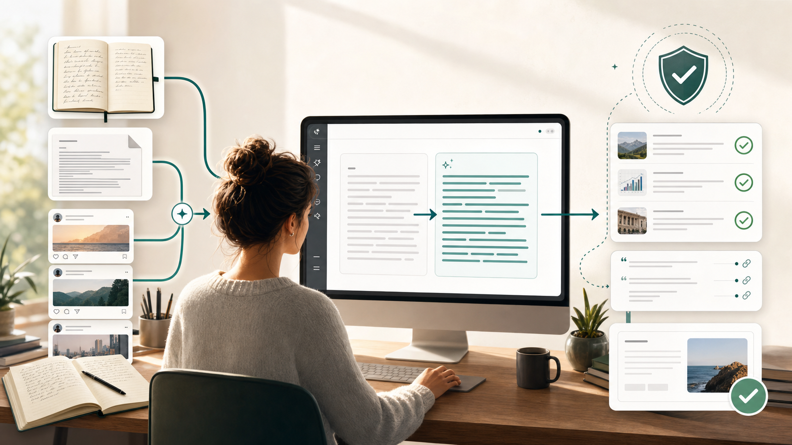
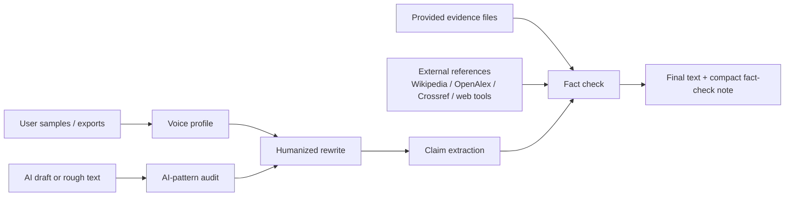

<p align="center">
  
</p>

<h1 align="center">humanize-skill</h1>

<p align="center">
  <strong>Make AI drafts sound like the user, then verify the claims before they ship.</strong>
</p>

<p align="center">
  <a href="./LICENSE"></a>
  
  
  
</p>

`humanize-skill` is a lightweight open-source skill for rewriting AI-looking text into a real human voice, preferably the user's own voice, while keeping factual claims grounded in evidence.

It is built from three reference ideas:

- [blader/humanizer](https://github.com/blader/humanizer): concrete AI-writing pattern cleanup.
- [tinyhumansai/openhuman](https://github.com/tinyhumansai/openhuman): local-first user context, source adapters, and provenance.
- [Oumi HallOumi](https://oumi.ai/blog/introducing-halloumi-a-state-of-the): claim extraction, evidence checks, citations, and support labels.

The result is deliberately small: no training pipeline, no background service, no mandatory OAuth broker, no model-specific lock-in.

## Why this exists

Most "humanize AI" tools only change the surface. They delete em dashes, add contractions, and call it done.

That is not enough.

Good humanized writing needs three things at once:

- **Voice**: it should sound like the person, not like generic "friendly SaaS copy".
- **Restraint**: it should remove AI tells without injecting fake personality.
- **Grounding**: it should not make unsupported facts sound more confident.

`humanize-skill` treats humanization as an editorial pipeline, not a vibe filter.

## Features

- **AI-pattern cleanup**: catches inflated significance, vague authority, promotional language, forced trios, chatbot residue, filler, and other common tells.
- **User voice profiling**: learns rhythm, diction, punctuation habits, paragraph shape, technical tone, and recurring vocabulary from local samples.
- **Local-first source ingestion**: works with pasted text, Markdown, JSON/JSONL, CSV/TSV, chat exports, social exports, and email/archive text.
- **External fact verification**: checks claims against provided evidence first, then searches public references when support is missing.
- **Conservative support labels**: returns `supported`, `needs_evidence`, `possibly_wrong`, or `style_only`.
- **One-command review reports**: combines audit, rewrite, and fact-check output as Markdown or JSON.
- **Zero dependency CLI**: standard-library Python helper for repeatable audits and tests.
- **Skill-native workflow**: the main product is [SKILL.md](./SKILL.md), ready to install in Codex/Claude Code/OpenCode-style environments.

## How it works



The fact-checker is intentionally conservative. It does not mark a claim as supported just because scattered search results contain overlapping keywords. A single reference must independently support enough of the claim.

## Quick start

Clone this repository or copy [SKILL.md](./SKILL.md) into your agent's skills directory.

Run the helper locally:

```bash
python3 scripts/humanize_skill.py audit draft.md
python3 scripts/humanize_skill.py profile samples/*.txt --out .humanize-skill/profile.json
python3 scripts/humanize_skill.py humanize draft.md --profile .humanize-skill/profile.json
python3 scripts/humanize_skill.py factcheck draft.md --evidence sources/*.md
python3 scripts/humanize_skill.py review draft.md --profile .humanize-skill/profile.json --evidence sources/*.md --out review.md
python3 scripts/humanize_skill.py factcheck draft.md --external
```

Install as a Python console script:

```bash
pip install -e .
humanize-skill audit draft.md
```

## Five Real Skill Runs

These examples were run through the skill in Codex, not only through the helper script. Each folder keeps the draft, writing sample, evidence, mechanical helper output, fact-check JSON, and the Codex editorial run.

| Scenario | AI-looking draft | Humanized result | Fact decision | Saved process |
| --- | --- | --- | --- | --- |
| Product email | "Our groundbreaking workspace serves as a pivotal solution..." | "We shipped a workspace that turns a rough AI draft into three things..." | Removed the unsupported "cut editing time in half" claim. | [run](./examples/product-email/codex-run.md) · [audit](./examples/product-email/audit.json) · [facts](./examples/product-email/factcheck.json) |
| Technical README | "This revolutionary CLI offers a robust and seamless developer experience..." | "`humanize-skill` is a small Python helper for cleaning up AI-looking prose..." | Replaced "perfect accuracy" with conservative review-surface language. | [run](./examples/technical-readme/codex-run.md) · [audit](./examples/technical-readme/audit.json) · [facts](./examples/technical-readme/factcheck.json) |
| Social post | "I am thrilled to announce... a definitive solution..." | "Small ship: I made a skill for cleaning up AI-looking drafts." | Corrected automatic social-history analysis to user-provided samples or exports. | [run](./examples/social-post/codex-run.md) · [audit](./examples/social-post/audit.json) · [facts](./examples/social-post/factcheck.json) |
| Support reply | "Great question!... your data is always safe." | "One thing to clarify first: the local helper does not sync your writing profile across channels." | Removed absolute safety and unsupported sync claims. | [run](./examples/support-reply/codex-run.md) · [audit](./examples/support-reply/audit.json) · [facts](./examples/support-reply/factcheck.json) |
| Research blog | "Studies show that humanized copy increases reader trust by 87%..." | "AI drafts often have two separate problems. They sound generic..." | Removed the fake 87% statistic and softened hallucination elimination. | [run](./examples/research-blog/codex-run.md) · [audit](./examples/research-blog/audit.json) · [facts](./examples/research-blog/factcheck.json) |

<details>
<summary>Product email</summary>

**Before**

```text
Great question! Our groundbreaking workspace serves as a pivotal solution for busy teams, showcasing how they can unlock seamless async collaboration across the modern AI landscape.
```

**After**

```text
We shipped a workspace that turns a rough AI draft into three things: a local voice profile, a cleaner rewrite, and a claim review you can hand to an editor.
```

**Process kept on disk**

- [draft](./examples/product-email/draft.md)
- [writing sample](./examples/product-email/sample.txt)
- [evidence](./examples/product-email/evidence.md)
- [voice profile](./examples/product-email/profile.json)
- [Codex run](./examples/product-email/codex-run.md)

</details>

<details>
<summary>Technical README</summary>

**Before**

```text
This revolutionary CLI offers a robust and seamless developer experience, enabling users to effortlessly transform AI-generated prose into authentic human communication.
```

**After**

```text
`humanize-skill` is a small Python helper for cleaning up AI-looking prose, building a compact voice profile from local samples, and checking claim-like sentences against evidence.
```

**Process kept on disk**

- [draft](./examples/technical-readme/draft.md)
- [writing sample](./examples/technical-readme/sample.txt)
- [evidence](./examples/technical-readme/evidence.md)
- [voice profile](./examples/technical-readme/profile.json)
- [Codex run](./examples/technical-readme/codex-run.md)

</details>

<details>
<summary>Social post</summary>

**Before**

```text
I am thrilled to announce that I have launched a groundbreaking open-source skill that empowers creators to reclaim their authentic voice in the AI era.
```

**After**

```text
Small ship: I made a skill for cleaning up AI-looking drafts.
```

**Process kept on disk**

- [draft](./examples/social-post/draft.md)
- [writing sample](./examples/social-post/sample.txt)
- [evidence](./examples/social-post/evidence.md)
- [voice profile](./examples/social-post/profile.json)
- [Codex run](./examples/social-post/codex-run.md)

</details>

<details>
<summary>Support reply</summary>

**Before**

```text
Great question! We sincerely apologize for any inconvenience this may have caused. Our system is designed to seamlessly synchronize your writing profile across every channel, and your data is always safe.
```

**After**

```text
One thing to clarify first: the local helper does not sync your writing profile across channels. It reads the files you choose and writes the profile where you tell it to.
```

**Process kept on disk**

- [draft](./examples/support-reply/draft.md)
- [writing sample](./examples/support-reply/sample.txt)
- [evidence](./examples/support-reply/evidence.md)
- [voice profile](./examples/support-reply/profile.json)
- [Codex run](./examples/support-reply/codex-run.md)

</details>

<details>
<summary>Research blog</summary>

**Before**

```text
Studies show that humanized copy increases reader trust by 87%, and tools that verify claims eliminate hallucinations.
```

**After**

```text
That does not eliminate hallucinations. It gives the writer a clearer review step before the text goes out.
```

**Process kept on disk**

- [draft](./examples/research-blog/draft.md)
- [writing sample](./examples/research-blog/sample.txt)
- [evidence](./examples/research-blog/evidence.md)
- [voice profile](./examples/research-blog/profile.json)
- [Codex run](./examples/research-blog/codex-run.md)

</details>

## External verification

The skill does not rely on the LLM's memory as a source of truth.

Verification order:

1. Check user-provided evidence and local files.
2. For missing, current, or high-risk claims, search external references.
3. Prefer official, primary, or scholarly sources when available.
4. Keep source title, URL, snippet, and matched terms.
5. If support is still weak, mark `needs_evidence` and soften or remove the claim.

The CLI currently includes lightweight search adapters for:

- Wikipedia
- OpenAlex
- Crossref
- DuckDuckGo HTML results when available

Host agents can also use their own web/search tools under the rules in [SKILL.md](./SKILL.md).

## CLI commands

The helper is intentionally mechanical. Use it for repeatable local passes, then apply editorial judgment in the agent response.

```bash
humanize-skill audit draft.md
humanize-skill profile samples/*.txt --out .humanize-skill/profile.json
humanize-skill humanize draft.md --profile .humanize-skill/profile.json
humanize-skill factcheck draft.md --evidence evidence/*.md --include-style-only
humanize-skill review draft.md --profile .humanize-skill/profile.json --evidence evidence/*.md --format json
```

`review` returns a compact report with:

- the AI-pattern audit
- the optional voice profile used
- the rules-based rewrite
- claim statuses and references when available

Use `--external` on `factcheck` or `review` only when network access is acceptable for the material being checked.

## Project structure

```text
.
├── SKILL.md                    # Agent-facing skill workflow
├── scripts/
│   └── humanize_skill.py       # Zero-dependency CLI helper
├── tests/
│   └── test_humanize_skill.py  # Unit tests for audit/profile/factcheck behavior
├── examples/                   # Five Codex skill runs with saved intermediate artifacts
├── docs/
│   ├── reference-analysis.md   # What was borrowed from the three references
│   └── source-ingestion.md     # Local-first real-user text ingestion policy
├── assets/
│   └── humanize-skill-hero.png # README hero image generated with gpt-image-2
├── pyproject.toml              # Editable install and console-script metadata
└── LICENSE
```

## Design principles

- **Small beats heavy**: this is a skill and helper, not a full desktop agent.
- **User data stays controlled**: build compact profiles, not raw private-message stores.
- **Voice is not decoration**: match rhythm and choices, not just slang.
- **Verification is separate**: rewrite first, fact-check second, then revise.
- **Unsupported specifics are a bug**: remove, soften, cite, or ask.

## Development

```bash
python3 -m unittest discover -s tests
python3 -m py_compile scripts/humanize_skill.py tests/test_humanize_skill.py
python3 scripts/humanize_skill.py review README.md --format json
```

The helper uses only the Python standard library.

## Roadmap

- Add source-quality scoring for external references.
- Add optional domain presets for product copy, README prose, essays, and social posts.
- Add CI-oriented exit codes for unsupported or possibly wrong claims.
- Add more archive readers for common chat/social export formats.
- Add examples showing voice profiles from bilingual samples.

## License

MIT. See [LICENSE](./LICENSE).
